# 单词表

- **A1**

  | 图片 | 单词 | 词性 | 释义 | 例句 | 近义词 | 反义词 |
  | :----: | --- | ---- | ---- | ---- | ---- | ---- |
  |  | nombre | s., m. | 名字 | Mi nombre es Isabel. | identidad | |
  |  | apellido | s., m. | 姓 | Mi apellido es Martínez. | nombre de familia | |
  | 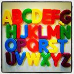 | abecedario | s., m. | 字母表 | El abecedario español tiene 27 letras. | alfabeto | |
  | 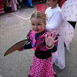 | saludar | v.,  tr. | 问候 | La niña saluda con la mano. | | despedirse |
  |  | beso | s., m. | 亲吻 | Te mando un beso. | | |
  |  | abrazo | s., m. | 拥抱 | Los hermanos se dan un fuerte abrazo. | | |
  |  | alfabeto | s., m. | 字母表 | El alfabeto español tiene 27 letras. | abecedario | |
  | 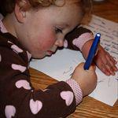 | escribir | v., tr. | 写 | Ana escribe en su libreta. | redactar |
  |  | despedirse | v., tr./intr. | 告别 | Ellas se despiden con un abrazo. | | saludar |
  |  | profesor | s., m. | 教授 | Él es profesor de matemáticas. | maestro |
  |  | asignatura | s., f. | 课程 | La asignatura favorita de los estudiantes es informática. | materia, disciplina | |
  |  | pizarra | s., f. | 黑板 | Peter escribe en la pizarra. | encerado | |
  |  | tiza | s., f. | 粉笔 | Esta tiza es de color amarillo. | gix (en México) | |
  | 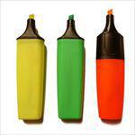 | rotulador | s., m. | 油性笔 | El rotulador de la izquierda es de color amarillo. | | |
  |  | ordenador | s., m. | 电脑 | La pantalla del ordenador es de color azul. | computadora (en Argentina) | |
  |  | bolígrafo | s., m. | 圆珠笔 | Yo escribo con bolígrafo. | lapicera (en Argentina) | |
  | 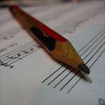 | lápiz | s., m. | 铅笔 | Este lápiz no es nuevo. | lapicero, grafito | |
  |  | diccionario | s., m. | 字典 | Yoshi busca una palabra en su diccionario japonés- inglés. | léxico, enciclopedia | |
  | 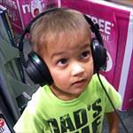 | escuchar | v., tr. | 听 | El niño escucha música. | percibir, oír | |
  |  | estudiar | v., tr. | 学习 | Esta chica estudia mucho. | aprender, memorizar | |
  |  | examen | s., m. | 考试 | Hoy hay examen de la asignatura. | prueba, ejercicio |
  |  | difícil | adj.,  m./f. | 困难的，困难 | Este salto es muy difícil. | complicado | fácil, sencillo |
  |  | biblioteca | s., f. | 图书馆 | Yo estudio en la biblioteca de la Universidad. | | |
  |  | preguntar | v., tr. | 提问 | El estudiante pregunta al profesor en clase. | interrogar, cuestionar | contestar, responder |
  |  | compañero | s., m. | 伙伴，伴侣 | Ana, Jose y Roberto son compañeros de clase. | colega | |
  |  | cita | s., f. | 约会 | Luis tiene cita con el dentista. | encuentro
  | 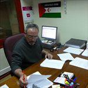 | director | s.m. | 经理，总管 | El señor Hervás es el director de la Universidad. | jefe | |
  | 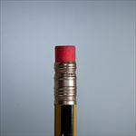 | goma | s., f. | 橡皮擦 | Este lápiz tiene goma de borrar. | | |
  |  | cero | s., m. | 零 | Esta cerveza es cero por ciento alcohol. | | |
  | 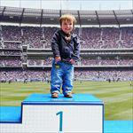 | uno | s., m. | 一 | En el puesto número uno está el ganador. | | |
  | 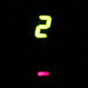 | dos | s., m. | 二 | El ascensor está en el piso número dos. | | |
  |  | tres | s., m. | 三 | Ella señala el número tres. | | |
  |  | cuatro | s., m. | 四 | La carta tiene el número cuatro. | | |
  |  | cinco | s., m. | 五 | Estamos en el piso número cinco. | | |
  | 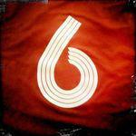 | seis | s., m. | 六 | La camiseta lleva el número seis. | | |
  |  | siete | s., m. | 七 | Hoy estamos a día siete. | | |
  | 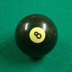 | ocho | s., m. | 八 | La bola de billar tiene el número ocho. | | |
  | 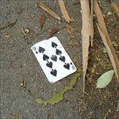 | nueve | s., m. | 九 | La carta es es el nueve de picas. | | |
  | 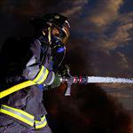 | bombero | s., m. | 消防员 | El bombero utiliza agua. | | |
  |  | fotógrafo | s., m. | 摄影师 | El fotógrafo trabaja con la cámara. | | |
  | 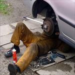 | mecánico | s., m. | 技师 | El mecánico prepara el coche. | | |
  |  | taxista | s., m./f. | 出租车司机 | El taxista conduce su taxi.
  |  | sueldo | s., m. | 工资，薪水 | Hoy recibo mi sueldo del mes. | salario | |
  | 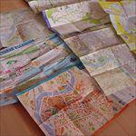 | mapa | s., m. | 地图 | Yo busco un lugar en el mapa. | plano | |
  | 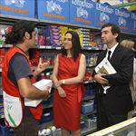 | contratar | v., tr. | 雇用 | Ellos contratan al chico para trabajar en el supermercado. | fichar | despedir |
  |  | dedicarse | v., tr. | 从事 | Ellos se dedican a la medicina. | trabajar | |
  |  | recepcionista | s., m./f. | 接待员 | La recepcionista atiende el teléfono.
  | 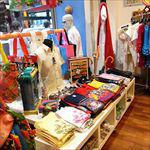 | tienda | s., f. | 商店 | Esta tienda es de ropa. | | |
  | 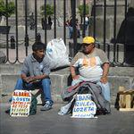 | estar en paro | expr. | 失业 | Estas dos personas están en paro y buscan trabajo. | estar desempleado/a | |
  |  | supermercado | s., m. | 超市 | Ellos compran en el supermercado. | | |
  |  | abuelo | s., m. | 祖父 | Este es mi abuelo. Se llama Vicente. | | |
  | 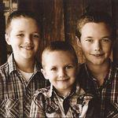 | hermano | s., m. | 兄弟 | En esta foto estamos mis hermanos mayores y yo. | | |
  |  | hijo | s., m. | 儿子 | El hijo de Rosana tiene 7 años. | | |
  |  | novio | s., m. | 男朋友 | El novio de Laura es muy simpático. | pareja, chico/a | |
  |  | corto | adj., m. | 短的 | Este pantalón es corto. | pequeño | largo |
  | 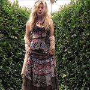 | largo | adj., m. | 长的 | Ella viste un vestido largo para la fiesta. | grande, amplio | largo |
  |  | moreno | adj., m. | 深色皮肤或头发的（人） | Estas personas son muy morenas de piel. | | |
  | 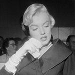 | rubio | adj., m. | 金色头发的（人） | Marylin Monroe es una de las rubias más famosas. | | |
  |  | romántico | adj., m. | 浪漫的 | Este chico es muy romántico. | apasionado | |
  |  | casarse | v., intr. | 结婚 | Ellos compran en el supermercado. | desposarse | divorciarse, separarse |
  |  | inteligente | adj., m./f. | 聪明的 | Albert Einstein es una persona inteligente. | listo | tonto, ignorante |
  | 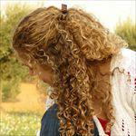 | rizado | adj., m. | 卷发的 | La chica de la foto tiene el pelo rizado. | ondulado | liso |
  |  | ayuntamiento | s., m. | 市政厅 | El Ayuntamiento de mi pueblo está en la plaza principal. | casa consistorial | |
  | 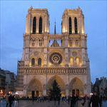 | catedral | s., f. | 教堂 | La catedral de Notre Dame en París es muy bonita. | | |
  | 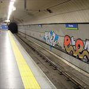 | estación | s., f. | 车站 | Esta estación de metro se llama Chueca. | parada, apeadero, terminal | |
  | 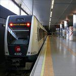 | metro | s., m. | 地铁 | El metro es un medio de transporte muy rápido. | | |
  | 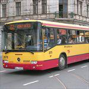 | autobús | s., m. | 公交车 | Yo todos los días tomo el autobús para ir al trabajo. | autocar, colectivo, guagua | |
  | 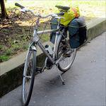 | bicicleta | s., f. | 自行车 | La bicicleta es muy práctica en pequeñas ciudades. | | |
  | 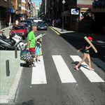 | cruzar | v., tr. | 穿过 | Yo cruzo la calle por el paso de cebra. | | |
  |  | ruidoso | adj., m. | 吵闹的 | El tráfico en las grandes ciudades es muy ruidoso. | sonoro | silencioso, tranquilo |
  |  | barato | adj. m. | 便宜的 | Este ordenador es más barato que aquel. | económico | caro |
  | 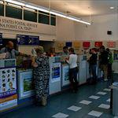 | Correos | s., m. | 邮局 | Voy a Correos a mandar una carta para mi familia. | | |
  | 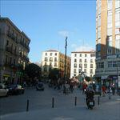 | barrio | s., m. | 社区 | Nosotros vivimos en el barrio de Lavapiés en Madrid. | distrito, barriada, zona | |
  | 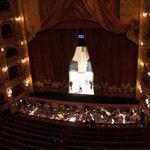 | teatro | s., m. | 剧院 | El Teatro Principal es el más grande de la ciudad. | sala | |
  | 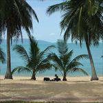 | playa | s., f. | 海滩 | En verano estamos en la playa. | | |
  | 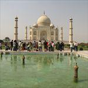 | monumento | s., m. | 纪念碑 | El Taj Mahal es uno de los monumentos más visitados de la India. | | |
  | 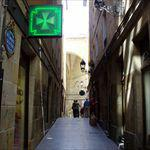 | farmacia | s., f. | 药店 | La farmacia tiene una cruz de color verde. | botica, laboratorio, herbolario | |
  | 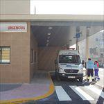 | hospital | s., m. | 医院 | Esta es la puerta de urgencias del hospital. | clínica | | |
  | 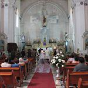 | iglesia | s., f. | 教堂 | En la iglesia se celebra una boda. | templo, basílica, parroquia, ermita, catedral, santuario, capilla | |
  | 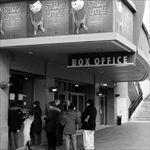 | cine | s., m. | 电影院 | Hay muchas personas en la taquilla del cine. | | |
  | 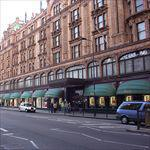 | centro comercial | s., m. | 商业中心 | Harrods es el centro comercial más famoso de Londres. | grandes almacenes | |
  |  | moderno | adj., m. | 现代的 | nuevo, actual, reciente, fresco | antiguo, obsoleto |
  |  | caminar | v., intr. | 走路 | Yo camino para ir a la escuela. | andar, pasear | detenerse |
  |  | girar | v., intr. | 转 | Giras a la derecha y está la escuela. | torcer, doblar | ir recto |
  | 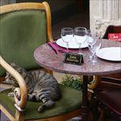 | reservar | v., tr. | 保留，预定 | Esta mesa del restaurante está reservada. | hacer una reserva, concertar |
  | 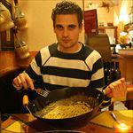 | restaurante | s., m. | 餐厅 | En este restaurante sirven comida italiana. | bar, cafetería |
  | 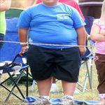 | gordo | adj. | 肥胖的 | Este niño está muy gordo. | grueso, obeso | delgado, flaco |
  |  | bocadillo | s., m. | 夹心面包 | Este bocadillo es de jamón. | bocata | |
  |  | fruta | s., f. | 水果 | La fruta que más me gusta es la manzana. | | |
  |  | beber | v., tr. | 喝 | Hoy bebo una cerveza. | tomar | |
  | 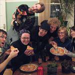 | comer | v., tr. | 吃 | Julia, Luca y sus amigos comen pizza. | tragar, zampar | ayunar |
  | 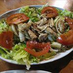 | ensalada | s., f. | 沙拉 | La ensalada es un plato frío. | | |
  | 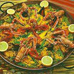 | paella | s., f. | 菜饭 | Esta paella es muy grande. | | |
  | 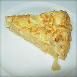 | tortilla | s., f. | 鸡蛋卷 | La tortilla española lleva patata y cebolla. | | |
  |  | frío | adj., m. | 冷的 | Esta ciudad es muy fría. | | |
  | 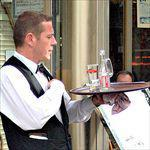 | camarero | s., m. | 服务员 | El camarero sirve las bebidas. | mesero (en Argentina) | |
  | 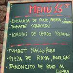 | menú | s., m. | 菜单 | El menú del día cuesta 10 euros. | carta | |
  | 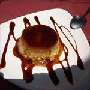 | postre | s., m. | 甜点 | Hoy de postre como flan. | | |
  | 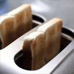 | desayunar | v., tr. | 吃早饭 | Ella desayuna un café y tostadas. | almorzar | ayunar |
  |  | leche | s., f. | 牛奶 | El niño bebe un vaso de leche. | | |
  |  | sándwich | s. m. | 三明治 | Este sándwich es vegetal: sólo está relleno de verdura, no carne. | bocadillo | |
  |  | queso | s., m. | 奶酪 | A los niños les gusta mucho el queso. | | |
  |  | jamón | s., m. | 火腿 | El camarero corta jamón. | | |
  |  | ordenar | v., tr. | 整理 | Yo ordeno mi habitación. | organizar, arreglar, clasificar | desordenar |
  |  | limpiar | v., tr. | 清理 | El chico limpia la casa. | lavar | manchar, ensuciar |
  |  | cenar | v., tr. | 吃晚餐 | Ellos cenan en un restaurante. | | |
  |  | yogur | s., m. | 酸奶 | Este yogur es de fresa. | | |
  |  | pescado | s., m. | 鱼肉 | Este pescado es muy grande. | pez | |
  |  | agua | s., f. | 水 | Esta botella de agua es de dos litros. | | |
  |  | correr | v., tr. | 跑 | El atleta corre en el maratón. | | |
  |  | periódico | s., m. | 报纸 | Mi abuelo lee el periódico. | diario | |
  |  | levantarse | v., pml. | 起床 | Él se levanta a las 8 de la mañana. | despertarse | acostarse |
  |  | peinarse | v., pml. | 梳头 | Violeta se peina con el secador de pelo. | | despeinarse |
  |  | ducharse | v., pml. | 淋浴 | Yo me ducho todos los días. | bañarse, lavarse | ensuciarse, mancharse |
  |  | maquillarse | v., pml | 化妆 | Ella se maquilla los ojos. | pintarse | |
  |  | gafas | s., f. | 眼镜 | Él lleva unas gafas de color azul. | lentes (en Argentina) | |
  |  | baño | s., m. | 浴室，洗手间 | El cuarto de baño es muy grande. | cuarto de baño, lavabo, servicio, aseo |
  |  | cómodo | adj., m. | 舒服的 | Este sofá es muy cómodo. | confortable | incómodo |
  |  | estudio | s., m. | 书房 | Ellos viven en un estudio en el centro de la ciudad. | apartamento | |
  |  | aparcamiento | s., m. | 停车位 | En este aparcamiento sólo hay un coche. | garaje, parking | |
  |  | televisión | s., f. | 电视 | Los niños están viendo la televisión. | televisor (s., m.) | |
  |  | radio | s., f. | 广播 | Las señoras escuchan la radio. | | |
  |  | libro | s., m. | 书 | Este libro tiene más de 300 páginas. | obra, ejemplar | |
  |  | activo | adj., m. | 活跃的 | Juan es un niño muy activo, siempre está moviéndose. | dinámico, vivo, enérgico | pasivo, inactivo |
  |  | sociable | adj., m./f. | 爱交际的 | Los burros son animales muy sociables. | simpático, accesible | antisociable, antipático |
  |  | parecer | v., copul. | 看起来 | Lucía parece muy simpática. | aparentar | |
  |  | pollo | s., m. | 小鸡，鸡肉 | Los pollos son de color amarillo. | | |
  |  | zapatos | s., m. | 鞋 | Estos zapatos tienen mucho tacón. | | |
  |  | zoológico | s., m. | 动物园 | En este zoológico hay osos panda. | | |
  |  | perro | s., m. | 狗 | El chihuahua es un perro muy pequeño. | can | |
  |  | gato | s., m. | 猫 | El gato persa tiene un pelo precioso. | minino, micho | |
  |  | sillón | s., m. | 扶手椅 | Mi abuelo lee un libro en el sillón. | butaca | |
  |  | jugar | v., tr./intr. | 玩 | El perro juega con la pelota. | | |
  |  | calefacción | s., f. | 暖气 | La calefacción está encendida. | | |
  |  | parque | s., m. | 公园 | Muchas personas pasean por el parque. | jardín, bosque | |
  |  | pesimista | adj., m./f. | 悲观的 | El chico es pesimista, piensa que va a suspender el examen. | | optimista |
  |  | separado | adj., m. | 分居 | Toni y María están separados desde hace quince meses. | | |
  |  | merendar | v., tr. | 吃下午茶 | El niño merienda un vaso de leche después del colegio. | | |
  |  | zumo | s., m. | 果汁 | Conchi hace un zumo de naranja. | jugo (en Argentina y México), néctar | |
  |  | luminoso | adj., m. | 有光的，发亮的 | La lámpara es muy luminosa. | brillante, radiante | oscuro, apagado |
  |  | exterior | adj., m/f | 外部的 | Mi piso tiene una terraza exterior. | | interior |
  |  | reproductor | s., m. | 播放器 | Este reproductor de DVD cuesta más de 50 euros. | | |
  |  | microondas | s., m. | 微波炉 | El microondas está encendido. | | |
  |  | palomitas | s., f. | 爆米花 | Ellos comen palomitas de maíz. | | |
  |  | actor | s., m. | 男演员 | Mi actor favorito es Johnny Depp. | intérprete | |
  |  | casado | adj., m. | 已婚的 | Guillermo de Inglaterra y Kate Middleton están casados desde el año 2011. | desposado | divorciado, separado soltero |
  |  | ojo | s., m. | 眼睛 | El bebé tiene los ojos de color azul. | | |
  |  | primo | s., m. | 表，堂兄弟 | David (izquierda) es el primo de Dani (derecha). | | |
  |  | Universidad | s., f. | 大学 | La Universidad de Harvard es la más famosa y conocida del mundo. | | |
  |  | comprender | v., tr. | 理解 | El chico no comprende la fórmula matemática. | entender, captar, enterarse | ignorar, desconocer |
  |  | repetir | v., tr. | 重复 | Siempre se repite la misma frase. | rehacer | |
  |  | horario | s., m. | 时间表 | El horario de apertura de la consulta es de 16 a 18h. | programa, agenda | |
  |  | currículum | s., m. | 简历 | Su currículum vitae no tiene foto. | currículum vitae, historial, hoja de vida | |
  |  | secretario | s., m. | 秘书 | La secretaria de la empresa habla con el jefe. | | |
  |  | turista | s., m./f. | 游客 | Los turistas japoneses hacen muchas fotos. | visitante, excursionista, viajero | |
  |  | excursión | s., f. | 远足 | Ellos van de excursión por la montaña. | paseo, caminata, salida | |
  |  | memoria | s., f. | 记忆 | Hacer puzzles es muy práctico para reforzar la memoria. | recuerdo | |
  |  | tinta | s., f. | 墨水 | El profesor está pintando con tinta china. | colorante, tinte | |
  |  | pincel | s., m. | 画刷 | El artista usa pincel para pintar. | brocha | |
  |  | mesa | s., f. | 桌子 | No hay nada encima de la mesa. | | |
  |  | lavadora | s., f. | 洗衣机 | La ropa está dentro de la lavadora. | lavarropas (en Argentina) | |
  |  | abrigo | s., m. | 大衣 | El abrigo es de color azul. | | |
  |  | carné de identidad | s., m. | 身份证 | Este es el carné de identidad de Pedro. | documento de identidad, carnet, documentación | |
  |  | bolso | s., m. | 包 | El bolso de la chica es muy grande. | | |
  |  | llevar | v., tr. | 穿，戴 | Ana lleva un sombrero. | vestir | |
  |  | concierto | s., m. | 演唱会 | Esta noche hay un concierto de Robbie Williams. | audición, función, sesión | |
  |  | entrada | s., f. | 入场券 | La entrada del cine cuesta 3,50 euros. | billete, tarjeta, tique | |
  |  | bailar | v., tr./intr. | 跳舞 | Ellos bailan un tango. | danzar | |
  |  | cantar | v., tr./intr. | 唱歌 | Anabel canta una canción. | entonar, interpretar | |
  |  | cama | s., f. | 床 | Su cama es muy grande. | | |
  |  | rojo | adj., m. | 红色的 | El pintalabios es de color rojo. | encarnado, escarlata | |
  |  | cuchara | s., f. | 勺子 | Ella toma la sopa con cuchara. | | |
  |  | cuchillo | s., m. | 刀 | El chico corta el pan con un cuchillo. | | |
  |  | tenedor | s., m. | 叉子 | Yo como la ensalada con tenedor. | | |
  |  | azúcar | s., m. | 糖 | Mario añade azúcar a su café. | | |
  |  | naranja | s., f. | 橘子 | La chica exprime una naranja. | | |
  |  | vaso | s., m. | 瓶子 | El niño bebe un vaso de agua. | copa | |
  |  | café | s., m. | 咖啡 | Por las mañanas tomo un café. | | |
  |  | aceite | s., m. | 油 | El aceite de oliva es uno de los símbolos de la cultura mediterránea. | óleo | |
  |  | sal | s., f. | 盐 | Nosotros cocinamos el pescado con sal. | | |
  |  | cocina | s., f. | 厨房 | Los cocineros preparan la cena en la cocina. | | |
  |  | pagar | v., tr. | 付款 | La mujer paga la compra del mercado. | abonar | cobrar |
  |  | pensar | v., tr. | 想，思考 | El estudiante piensa la respuesta de la fórmula matemática. | razonar, reflexionar | |
  |  | volver | v., tr. | 返回，回到 | La familia vuelve a casa de sus vacaciones. | regresar, retornar | irse, marcharse |
  |  | calle | s., f. | 街道 | La calle está vacía. | vía | |
  |  | estrecho | adj., m. | 窄的 | El paso más estrecho del mundo está en Praga. | ajustado | ancho, amplio |
  |  | entrar | v., intr. | 进入 | La persona entra por la puerta. | pasar, acceder | salir |
  |  | ir a pie | expr. | 步行 | Ellos van a pie al trabajo. | caminar, andar | |
  |  | falda | s., f. | 短裙 | La chica lleva una falda de color verde. | pollera (en Argentina) | |
  |  | verde | adj., m./.f | 绿色 | La hierba es de color verde. | | |
  |  | verano | s., m. | 夏天 | En verano vamos a la playa. | estío | invierno |
  |  | discoteca | s., f. | 歌舞厅 | En Ibiza hay muchas discotecas. | disco, club | |
  |  | vestido | s., m. | 连衣裙 | La actriz Salma Hayek lleva un bonito vestido. | | |
  |  | sol | s., m. | 太阳 | Hoy hace un día con mucho sol. | | |
  |  | guapo | adj., m. | 帅的，好看的 | Ryan Gosling, además de buen actor, es muy guapo. | lindo (en Argentina), atractivo, bello, hermoso | feo |
  |  | oferta | s., f. | 折扣 | En esta tienda hay una oferta. | promoción | |
  |  | viejo | adj., m. | 旧的，老的 | El coche está muy viejo. | anciano, abuelo (persona), anticuado, estropeado (objetos) | joven (persona), moderno (objeto) |
  |  | dependiente | s., m. | 店员 | La dependienta atiende al hombre. | empleado, vendedor | |
  |  | invierno | s., m. | 冬天 | En invierno las personas llevan abrigo. | | verano, estío |
  |  | blusa | s., f. | 女衬衣 | La chica viste una blusa blanca. | túnica, camisola | |
  |  | sandalias | s., f. | 拖鞋 | Estas sandalias llevan un poco de tacón. | chanclas, ojotas (en Argentina) | |
  |  | pantalón | s., m. | 裤子 | Elena lleva un pantalón de vestir de color negro. | | |
  |  | bufanda | s., f. | 围巾 | Hoy hace mucho frío y la chica se abriga con una bufanda. | | |
  |  | gorro | s., m. | 无檐帽 | La chica lleva un gorro de varios colores. | | |
  |  | azul | adj., m./f. | 蓝色 | El pez es azul. | | |
  |  | rosa | adj., m./f. | 粉红色的，玫瑰色的 | La niña lleva un vestido rosa. | | |
  |  | talla | s., f. | 型号，大小 | La camisa roja es de la talla S. | medida | |
  |  | guardar | v., tr. | 保存，保留 | La señora guarda la comida en la nevera. | esconder, conservar, tener, almacenar | sacar, entregar, dar |
  |  | banco | s., m. | 银行 | Ellos van al banco a sacar dinero. | | |
  |  | norte | s., m. | 北方 | España está al norte de África. | | sur |
  |  | sur | s., m. | 南方 | España está al sur de Francia. | | norte |
  |  | este | s., m. | 东方 | Valencia está al este de España. | oriente | |
  |  | oeste | s., m. | 西方 | Portugal está al oeste de la Península Ibérica. | occidente | |
  |  | camisa | s., f. | 衬衫 | El chico viste una camisa con cuello a rayas. | blusa (para mujer) | |
  |  | corbata | s., f. | 领带 | El modelo lleva un traje con corbata. | | |
  |  | zapatillas | s., f. | 运动鞋 | Estas zapatillas tienen un color muy llamativo. | deportivas, bambas (en Barcelona), tenis (en México), playeras (en el norte de España) | |
  |  | marrón | adj., m./f. | 棕色的 | La chica tiene los ojos de color marrón. | castaño (para cabello) | |
  |  | primavera | s., f. | 春天 | Las flores se abren en primavera. | | |
  |  | pedir | v., tr. | 请求 | El perro pide la comida. | solicitar, reclamar | dar, ofrecer |
  |  | viudo | adj., m. | 丧偶的 | La madre de Ana y Pedro es viuda. | | |
  |  | serio | adj., m. | 严肃的 | Nuestro jefe es muy serio. | seco (coloq.) | alegre |
  |  | bigote | s., m. | 胡子 | El hombre lleva un bigote muy largo. | mostacho | |
  |  | barba | s., f. | 络腮胡 | Manuel tiene barba. | perilla | |
  |  | edificio | s., m. | 建筑物 | Este edificio es muy moderno y alto. | bloque, finca | |
  |  | calcetines | s., m. | 袜子 | Este hombre lleva calcetines para andar por casa. | zoquetes (en Argentina) | |
  |  | jersey | s., m. | 毛衣 | Su jersey es muy ancho. | pulóver (en Argentina), suéter | |
  |  | traje | s., m. | 西装 | El niño lleva un traje negro a la fiesta. | | |
  |  | tío | s., m. | 叔叔 | Mi tío se parece a mi padre. | | |
  |  | soltero | adj., m. | 单身的 | Julieta no tiene novio, está soltera. | | |
  |  | coger | v., tr. | 拿起 | El niño coge una manzana del árbol. | tomar, agarrar, sujetar | soltar, dejar, liberar |
  |  | policía | s., m./f. | 警察 | El policía dirige el tráfico. | agente | |
  |  | primero | adj., m. | 第一的 | La chica llega la primera a la meta de la carrera. | inicial, principal | último |
  |  | segundo | adj., m. | 第二的 | Julián es el segundo en la cola. | posterior, siguiente | |
  |  | amplio | adj., m. | 宽的 | La plaza de Tian’anmen en China es la más amplia del mundo. | grande, ancho | estrecho |
  |  | alfombra | s., f. | 地毯 | En mi habitación hay una pequeña alfombra de colores. | moqueta, tapiz, felpudo | |
  |  | dormitorio | s., m. | 卧室 | Este es el dormitorio del bebé. | cuarto | |
  |  | cajero | s., m. | 收银员 | Mariví trabaja como cajera en el supermercado. | | |
  |  | recto | adj., m. | 直的，直接的 | Todo recto está la plaza principal de la ciudad. | derecho, directo | |
  |  | bañador | s., m. | 泳衣 | El chico viste un bañador gris para ir a la playa. | | |
  |  | museo | s., m. | 博物馆 | Hoy vamos al museo de arte. | galería, sala | |
  |  | exposición | s., f. | 展览 | Estamos en la exposición de automóviles clásicos. | muestra, exhibición | |
  |  | nadar | v., intr. | 游泳 | El perro nada muy bien. | bracear | hundirse |
  |  | piscina | s., f. | 游泳池 | Los niños están dentro de la piscina. | alberca (en México y Honduras, piscina deportiva), pileta (en Argentina, Bolivia y Uruguay) | |
  |  | tímido | adj., m. | 害羞的 | El chico es demasiado tímido y se pone rojo. | | extrovertido |
  |  | pareja | s., f. | 伴侣 | Julia es la pareja de Luis. | | |
  |  | avenida | s., f. | 大道 | Los novios pasean por la avenida de los Campos Elíseos de París. | vía, paseo | |
  |  | ópera | s., f. | 歌剧 | Esta es la cantante de ópera. | | |
  |  | actuar | v. intr. | 表演 | Los actores actúan en la obra de teatro. | | |
  |  | música | s., f. | 音乐 | Nosotros vamos a un concierto de música clásica. | | |
  |  | pase | s., m. | 通行证 | Ella tiene un pase de prensa. | | |
  |  | prismáticos | s., m. | 望远镜 | Él utiliza los prismáticos para ver mejor. | anteojos, binoculares | |
  |  | vino | s., m. | 葡萄酒，白酒 | El camarero sirve una botella de vino. | caldo | |
  |  | copa | s., f. | 杯子 | Ellos brindan con copas de cristal. | vaso | |
  |  | exótico | adj., m. | 外来的 | El durián es un fruto exótico de Asia. | extravagante, forastero | autóctono, nacional |
  |  | palco | s., m. | 包厢 | Los espectadores están en el palco del teatro. | platea, balcón | |
  |  | aeropuerto | s., m. | 飞机场 | Nosotros estamos en el aeropuerto. | aeródromo | |
  |  | mochila | s., f. | 背包 | Los chicos van con mochila a la escuela. | | |
  |  | pasaporte | s., m. | 护照 | Ella enseña su pasaporte. | | |
  |  | avión | s., m. | 飞机 | Ese avión es el nuestro. | aeronave, aeroplano | |
  |  | montaña | s., f. | 山 | Esta montaña está en Tenerife. | monte, sierra | |
  |  | volar | v., intr. | 飞 | El pájaro vuela muy alto. | | |
  |  | miedo | s., m. | 害怕，恐惧 | Scooby-Doo siempre tiene miedo. | temor, terror, pánico | valor, valentía |
  |  | otoño | s., m. | 秋天 | El paisaje en otoño es de color marrón. | | |
  |  | maleta | s., f. | 箱子 | No puedo cerrar la maleta. | valija, equipaje | |
  |  | hotel | s., m. | 旅店，宾馆 | Este hotel es enorme. | | |
  |  | recuerdo | s., m. | 纪念品 | Estos recuerdos son de Holanda. | souvenir (voz francesa) | |
  |  | hostal | s., m. | 小旅馆 | Nuestro hostal es un poco antiguo. | | |
  |  | gimnasio | s., m. | 体育馆 | Los chicos están haciendo deporte en el gimnasio. | | |
  |  | baloncesto | s., m. | 篮球 | Nosotros jugamos a baloncesto por las tardes. | básquet (en Argentina), basket | |
  |  | fútbol | s., m. | 足球 | El chico juega al fútbol. | balompié | |
  |  | partido | s., m. | 比赛 | El partido va a comenzar. | competición, partida | |
  |  | esquiar | v., intr. | 滑雪 | Las personas esquían en la nieve. | | |
  |  | ganar | v., tr. | 赢得，获胜 | Los jugadores que ganan levantan la copa. | vencer | perder |
  |  | deportista | s./adj., m./f. | 运动员 | Rafa Nadal es uno de los mejores deportistas españoles. | gimnasta, jugador, atleta | |
  |  | estadio | s., m. | 体育场 | El estadio es bastante grande. | | |
  |  | tenis | s., m. | 网球 | Las chicas juegan a tenis. | | |
  |  | raqueta | s., f. | 球拍 | Estas son mis raquetas. | pala | |
  |  | equipo | s., m. | 球队 | El equipo saluda a los espectadores. | conjunto | |
  |  | balón | s., m. | 球 | El balón está muy usado. | pelota, bola, esférico, cuero | |
  |  | disco | s., m. | 光碟 | Vamos a escuchar este disco. | CD (cedé) | |
  |  | festival | s., m. | 节日 | Los actores van al festival de cine. | certamen, muestra | |
  |  | programa | s., m. | 计划，项目 | Los espectadores leen el programa de las fiestas. | plan, programación | |
  |  | escenario | s., m. | 舞台，场景 | Los artistas no están aún sobre el escenario. | | |
  |  | espectacular | adj., m./f. | 壮观的 | Esta limusina es espectacular. | grandioso | |
  |  | de bote en bote | expr. coloq. | 人山人海的 | La discoteca está de bote en bote esta noche. | lleno, hasta los topes (expr.), hasta la bandera (expr.) | |
  |  | gira | s., f. | 巡回演出 | Este cantante tiene una gran gira por delante. | tournée, tour (voz francesa), turné | |
  |  | mundial | adj., m./f. | 全球的 | El día de la madre es una celebración mundial. | internacional | local, nacional |
  |  | revista | s., f. | 杂志 | Ellas leen una revista. | | |
  |  | hacer cola | expr. coloq. | 排队 | Las personas hacen cola en la taquilla del cine. | | |
  |  | oportunidad | s., f. | 机会 | El precio de estos ordenadores es una oportunidad única. | ocasión | |
  |  | en directo | expr. | 直接 | El locutor de radio explica el partido en directo. | en vivo | en diferido (para tv y radio), en play-back (voz inglesa, para la música) |
  |  | almorzar | v., tr. | 吃午餐 | Ellos almuerzan un bocadillo en el bar. | | |
  |  | plátano | s., m. | 香蕉 | El postre es plátano con chocolate. | banana (en Argentina) | |
  |  | melocotón | s., m. | 桃子 | El niño come un melocotón. | durazno (en Argentina y México) | |
  |  | té | s., m. | 茶 | A María le gusta beber té. | infusión | |
  |  | cafetería | s., f. | 咖啡厅 | Las amigas toman algo en la cafetería. | café | |
  |  | plaza | s., f. | 广场 | Esta es la plaza Quancheng de la ciudad de Jinan. | glorieta, ciudadela | |
  |  | fuente | s., f. | 喷泉 | El perro bebe agua de la fuente. | fontana, manantial | |
  |  | terraza | s., f. | 屋顶，阳台 | Mis amigas y yo tomamos unas tapas en la terraza del bar. | | |
  |  | antiguo | adj., m. | 古老的 | Esta escultura es muy antigua. | viejo, anticuado, tradicional | reciente, actual, moderno |
  |  | dar una vuelta | expr. | 出去走走 | Ellos dan una vuelta por la playa. | | |
  |  | domingo | s., m. | 周日 | El domingo las tiendas están cerradas. | | |
  |  | acompañar | v., tr. | 陪伴 | La madre acompaña a sus hijas al colegio. | | abandonar |
  |  | Derecho | s., m. | 法律 | La balanza es el símbolo del Derecho. | | |
  |  | entrevista | s., f. | 面试 | La mujer hace una entrevista al candidato. | reunión, encuentro | |
  |  | jornada laboral | s., f. | 工作时间 | Su jornada laboral es muy larga. | | |
  |  | Arte | s., f. | 艺术 | Yo estudio Arte. | | |
  |  | empresa | s., f. | 公司 | Este es el edificio de nuestra empresa. | compañía | |
  |  | ejercicio | s., m. | 作业 | La niña hace un ejercicio para la clase de lengua. | práctica, prueba | |
  |  | Medicina | s., f. | 医学 | Él es médico y ha estudiado Medicina. | | |
  |  | oficina | s., f. | 办公室 | No hay nadie en la oficina. | despacho | |
  |  | prueba | s., f. | 测试 | Hoy tienen una prueba. | examen, demostración, ejercicio | |
  |  | temporal | adj., m./f. | 暂时的 | Los dientes de leche son temporales. | eventual, provisional | indefinido, permanente, fijo |
  |  | anuncio | s., m. | 通知 | Este es un anuncio de una bebida muy famosa. | aviso, publicidad | |
  |  | suerte | s., f. | 运气 | El trébol es un símbolo de buena suerte. | fortuna, ventura | desgracia |
