# 单词表

----

- **A1U1**

| 图片 | 单词 | 词性 | 释义 | 例句 | 近义词 | 反义词 |
| --- | --- | ---- | ---- | ---- | ---- | ----- |
| 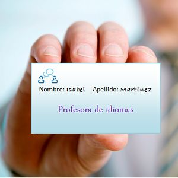 | nombre | s.,m. | 名字 | Mi nombre es Isabel. | identidad | |
|  | apellido | s.,m. | 姓 | Mi apellido es Martínez. | nombre de familia | |
|  | abecedario | s.,m. | 字母表 | El abecedario español tiene 27 letras. | alfabeto | |
|  | saludar | v., tr. | 问候 | La niña saluda con la mano. | | despedirse |
| 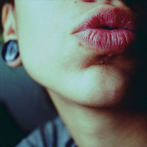 | beso | s.,m. | 亲吻 | Te mando un beso. | | |
| 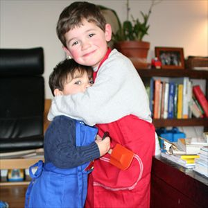 | abrazo | s.,m. | 拥抱 | Los hermanos se dan un fuerte abrazo. | | |
|  | alfabeto | s.,m. | 字母表 | El alfabeto español tiene 27 letras. | abecedario | |
| 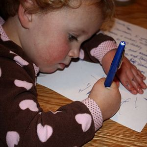 | escribir | v.,tr. | 写 | Ana escribe en su libreta. | redactar |
|  | despedirse | v.,tr./intr. | 告别 | Ellas se despiden con un abrazo. | | saludar |
| 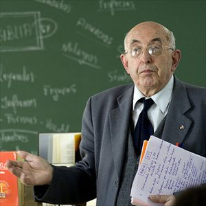 | profesor | s.,m. | 教授 | Él es profesor de matemáticas. | maestro |
| 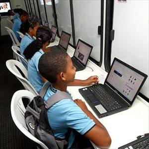 | asignatura | s.,f. | 课程 | La asignatura favorita de los estudiantes es informática. | materia, disciplina | |
| 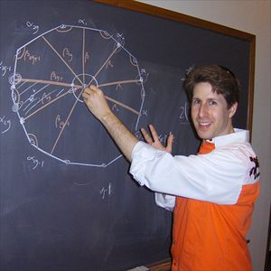 | pizarra | s.,f. | 黑板 | Peter escribe en la pizarra. | encerado | |
| 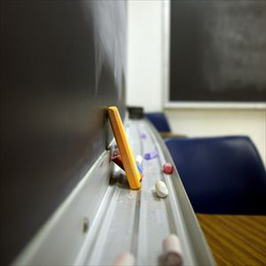 | tiza | s.,f. | 粉笔 | Esta tiza es de color amarillo. | gix (en México) | |
|  | rotulador | s.,m. | 油性笔 | El rotulador de la izquierda es de color amarillo. | | |
| 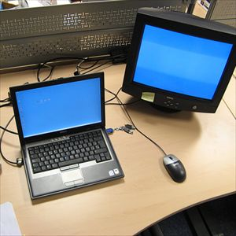 | ordenador | s.,m. | 电脑 | La pantalla del ordenador es de color azul. | computadora (en Argentina) | |
| 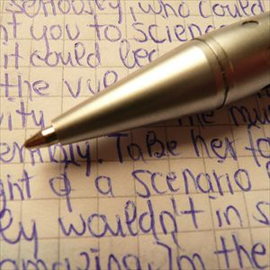 | bolígrafo | s.,m. | 圆珠笔 | Yo escribo con bolígrafo. | lapicera (en Argentina) | |
| 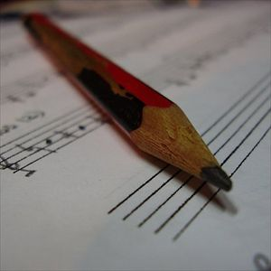 | lápiz | s.,m. | 铅笔 | Este lápiz no es nuevo. | lapicero, grafito | |
| 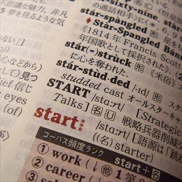 | diccionario | s.,m. | 字典 | Yoshi busca una palabra en su diccionario japonés- inglés. | léxico, enciclopedia | |
| 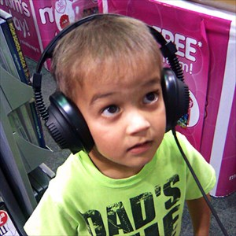 | escuchar | v.,tr. | 听 | El niño escucha música. | percibir, oír | |
| 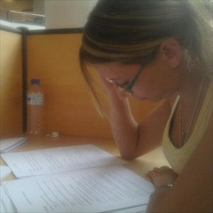 | estudiar | v.,tr. | 学习 | Esta chica estudia mucho. | aprender, memorizar | |
| 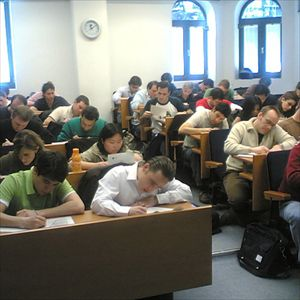 | examen | s.,m. | 考试 | Hoy hay examen de la asignatura. | prueba, ejercicio |
| 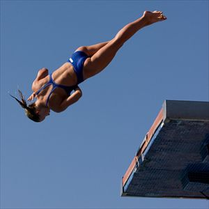 | difícil | adj., m./f. | 困难的，困难 | Este salto es muy difícil. | complicado | fácil, sencillo |
| 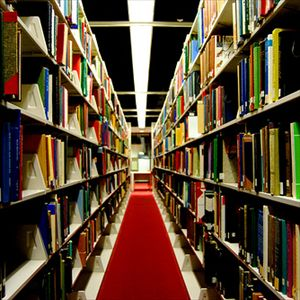 | biblioteca | s.,f. | 图书馆 | Yo estudio en la biblioteca de la Universidad. | | |
| 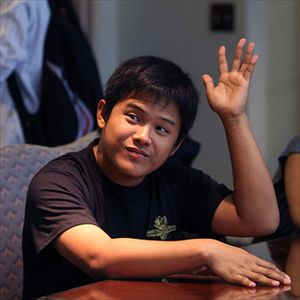 | preguntar | v.,tr. | 提问 | El estudiante pregunta al profesor en clase. | interrogar, cuestionar | contestar, responder |
|  | compañero | s.,m. | 伙伴，伴侣 | Ana, Jose y Roberto son compañeros de clase. | colega | |
| 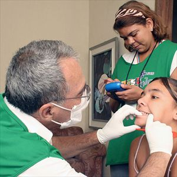 | cita | s.,f. | 约会 | Luis tiene cita con el dentista. | encuentro
|  | director | s.m. | 经理，总管 | El señor Hervás es el director de la Universidad. | jefe | |
| 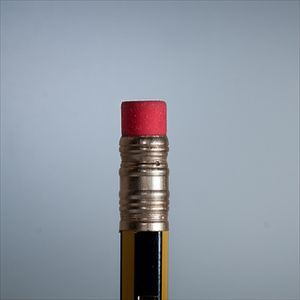 | goma | s.,f. | 橡皮擦 | Este lápiz tiene goma de borrar. | | |
| 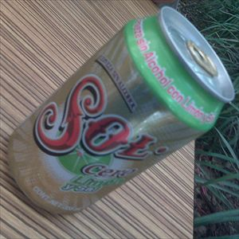 | cero | s.,m. | 零 | Esta cerveza es cero por ciento alcohol. | | |
| 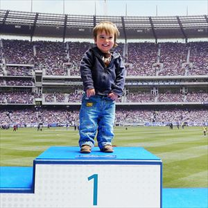 | uno | s.,m. | 一 | En el puesto número uno está el ganador. | | |
| 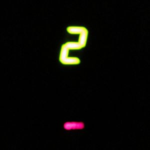 | dos | s.,m. | 二 | El ascensor está en el piso número dos. | | |
| 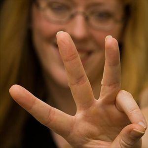 | tres | s.,m. | 三 | Ella señala el número tres. | | |
| 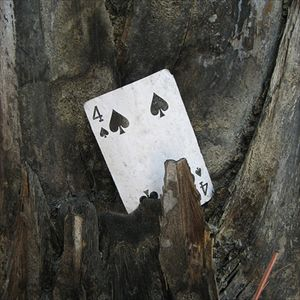 | cuatro | s.,m. | 四 | La carta tiene el número cuatro. | | |
| 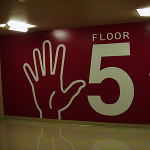 | cinco | s.,m. | 五 | Estamos en el piso número cinco. | | |
|  | seis | s.,m. | 六 | La camiseta lleva el número seis. | | |
| 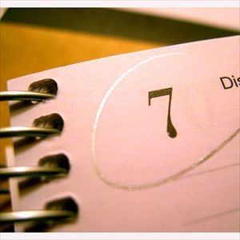 | siete | s.,m. | 七 | Hoy estamos a día siete. | | |
|  | ocho | s.,m. | 八 | La bola de billar tiene el número ocho. | | |
| 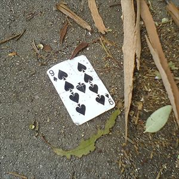 | nueve | s.,m. | 九 | La carta es es el nueve de picas. | | |
